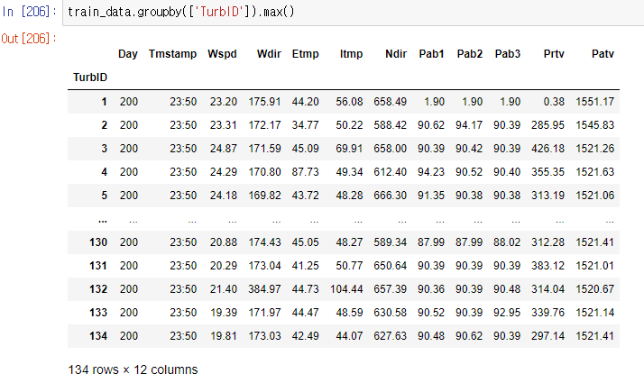
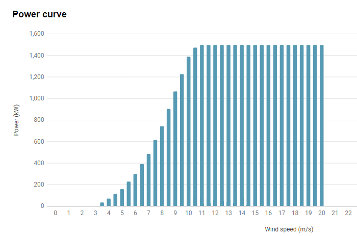
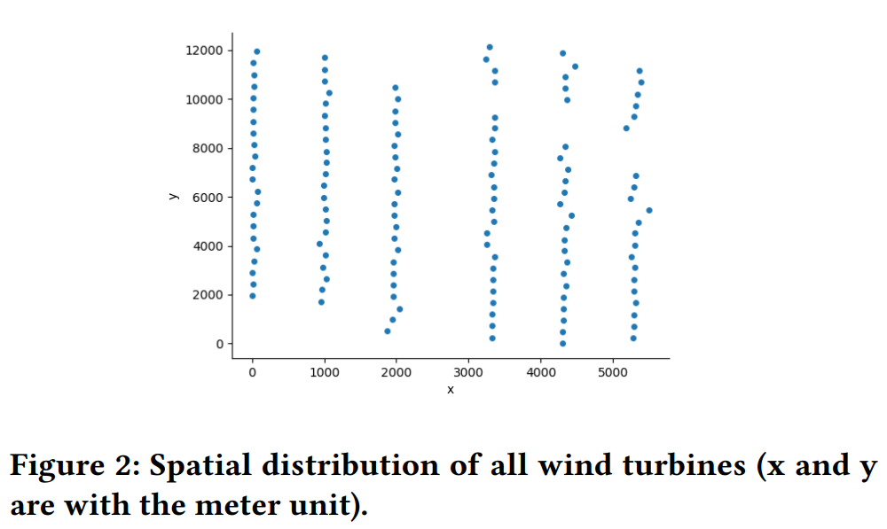

# 2022 인하 인공지능 챌린지 | Spatio-Temporal

> **대회 일정**
> 
> 1. 대회 기간: 22. 6. 20. ~ 22. 7. 22.
> 2. 본 대회: 22. 7. 29. 14:00 ~ 18:00
>    1. Test 데이터셋 공개: 14:00
>    2. 리더보드 운영: 14:00 ~ 18:00
>    3. 소스코드 및 발표자료 제출: 18:00 까지
> 3. 순위발표: 22. 8. 5. 17:00
> 4. 발표 및 시상식: 22. 8. 11. 13:00 ~ 18:00

**서버접속 정보**
>http://165.246.34.147:26042 \
> pw: baidu2022

# 1. [데이터](https://dacon.io/competitions/official/235926/talkboard/406431?page=1&dtype=recent)

```
TurbID  - Wind turbine ID, 발전기 ID
Day     - Day of the record, 날짜
Tmstamp - Created time of the record, 시간
Wspd(m/s) - The wind speed recorded by the anemometer, 풍속
Wdir(°)  - wind direction, 터빈이 바라보는 각도와 실제 바람 방향 각도 차이
Etmp(℃)  - Temperature of the surounding environment, 외부 온도
Itmp(℃)  - Temperature inside the turbine nacelle, 터빈 내부 온도
Ndir(°)  - Nacelle direction, i.e., the yaw angle of the nacelle, 터빈이 바라보는 방향 각도
Pab(°)   - Pitch angle of blade,터빈 당 3개의 날이 있으며 각각의 각도가 다름
Prtv(kW) - Reactive power, 무효전력 : 에너지원을 필요로 하지 않는 전력
Patv(kW) - Active power (target variable), 유효전력 : 실제로 터빈을 돌리는 일을 하는 전력
```

## 1.1 `Prtv` vs `Patv`
[reactive vs active power](https://www.youtube.com/watch?v=rY-mcPmL8u0)

## 1.2 과제 정의
[wikipedia: wind turbine](https://en.wikipedia.org/wiki/Wind_turbine#Horizontal_axis;%20https://en.wikipedia.org/wiki/Wind_turbine#Components) \
주최 측의 설명이 없지만 Ndir(nacelle)가 있는 것을 미루어 풍차형 발전기라는점을 알 수 있다.

Pab가 3개 있는 것으로 날개 3개인 프로펠러형 풍차라는 것을 추측할 수 있다.

본 대회의 풍력발전기는 날개 3개의 프로펠러형 풍차라고 가정한다.

 \
Power (W) = 1/2 x ρ x A x v3 x C \
Power = Watts\
ρ (rho, a Greek letter) = density of the air in kg/m3\
A = cross-sectional area of the wind in m2\
v = velocity of the wind in m/s
C = power coefficient(in ideal condition 16/27, not more than)

생산되는 출력으로 대략적인 터빈의 크기 A 를 가늠해볼 수 있다. 
공기 밀도는 온도, 기압과 관련이 있는데 다음과 같다. 

###air density fomular 

 \
m is the molecular mass of dry air, approximately 4.81×10−26 in kg. \
Kb is the Boltzmann constant, 1.380649×10−23 in J⋅K−1 \
p, absolute pressure (Pa) \
T, absolute temperature (K)

해수면이라고 가정했을때 P = 101325 Pa \
1431.0 m or 4694.9 feet
avg temp = 26
85825.58 Pa
Location :40.70900,96.28050

(4.81×10−26 in kg * 85825.58 Pa) / (1.380649×10−23 * (temperature in celsius + 273.15)\
= 299/(temperature in celsius + 273.15) 

Power (W) = 1/2 x 299/(t + 273.15) x 5398m² x v^3 x C 
          = 807,001/(t + 273.15)x v^3 x C 


Power(kW) = 807/(t + 273.15)x v**3 x C

rated wind speed 10.5m/s at 26degrees
Power(kW) = 807/300x v**3 x C
      1550= 3,114.01125 * C
C = 0.5

### [터빈 종류 및 스펙](https://en.wind-turbine-models.com/turbines)

**Patv**의 최대값이 대략 1500KW,즉 **1.5MW**라고 볼 수 있다. \
134개의 터빈이 있으므로 해당 wind farm은 **201MW**급이다.

[확실한 위치](https://www.gem.wiki/Gansu_Guazhou_Beidaqiao_3_wind_farm)
[추가](https://globalenergymonitor.org/projects/global-wind-power-tracker/tracker-map/)

134개의 1.5MW 터빈, 201MW급의 wind farm을 검색해보자. \
[관련 기사](https://www.power-technology.com/marketdata/inner-mongolia-huitengxile-huadian-kulun-china/) \
**Inner Mongolia** Huitengxile Huadian Kulun is a **201MW** onshore wind power project. 
owned by Inner Mongolia Huadian Power Huitengxile Wind Power의 소유 \
The company provided **134 units of [SL1500/82](https://en.wind-turbine-models.com/turbines/1617-sinovel-sl1500-82#powercurve) turbines**, each with **1.5MW nameplate capacity.** \
[추가 검색 결과](https://www.gem.wiki/Inner_Mongolia_Chayouzhong_Banner_Huitengxile_2_(Huadian)_wind_farm) \
GPS coordinate (41.7181, 112.6019) \
[wind farm project design document](https://cdm.unfccc.int/filestorage/J/E/6/JE678CTQ1G92FOLV5HXUDNAIK0ZYMS/PDD%203539.pdf?t=NHN8cmVwMXR6fDBUE_ABl_2cCvtvSW1B--d_) 

조사 결과 내 몽골에 위치한 풍력발전소이고, 중국 Sinovel사의 SL1500/82 [spec page](http://www.sinovel.com/english/content/?106.html) 82.0 m의 지름을 가진 터빈임을 찾았다. 

cut-in 풍속 : 3m/s \
cut-out 풍속 : 25m/s \
Rated wind speed: 10.5 m/s \


후보 2. 
[longyuan](https://www.power-technology.com/marketdata/inner-mongolia-baotou-bayin-wind-farm-china/)

[report](https://www1.hkexnews.hk/listedco/listconews/sehk/2009/1127/00916/ewplongy-20091120-24.pdf) \
[project report](https://cdm.unfccc.int/filestorage/Y/L/X/YLXDH8W92UC1QZATBVK50OEF346GI7/pdd.pdf?t=WE98cmVwa3lzfDBpHDUyC4ZBKeKpdQH7RcBp) \
[gw 1.5/77](https://www.goldwindamericas.com/sites/default/files/Goldwind-Brochure-1.5-Web.pdf)

[다른 후보](https://www.deif.com/wind-power/cases/retrofit-md77-for-dongfang/)
[3번 Minensota](https://mn.gov/eera/web/project-file/11688/))
Wind turbine spacing \
On most horizontal wind turbine farms, a spacing of about 6–10 times the rotor diameter is often upheld. However, for large wind farms distances of about 15 rotor diameters should be more economical, taking into account typical wind turbine and land costs. 


## 1.3 Spatial distribution of all wind turbines


[Question about relative spatial coordinate system](https://github.com/PaddlePaddle/PaddleSpatial/discussions/179)
→ XY축이 위도/경도를 나타내는 것이 아니라 임의의 변환을 사용해서 나타낸 결과임
→ 터빈의 **방향**과 **상대적인 위치**를 변화시키진 않았음

## 1.4 Caveats about the data
1. **Zero values**
   ```
   Prtv = 0 if Prtv < 0
   Patv = 0 if Patv < 0
   ```
2. **Missing values**
   ```
   |Patv[t] - Patv'[t]| = 0 if missing values are in features or target
   ```
3. **Unknown values**
   ```
   |Patv[t] - Patv'[t]| = 0 if Patv ≤ 0 and Wspd > 2.5
   |Patv[t] - Patv'[t]| = 0 if Pab1 > 89 or Pab2 > 89 or Pab3 > 89
   ```
4. **Abnormal values**
   ```
   |Patv[t] - Patv'[t]| = 0 if Ndir ⊈ [-720, 720]
   |Patv[t] - Patv'[t]| = 0 if Wdir ⊈ [-180, 180]
   ```


# 2. [평가](https://dacon.io/competitions/official/235926/overview/rules)
## 2.1 평가 산식 및 평가 규제


```
- 특정 시간에 측정되지 않은 경우, 해당 Patv에 대하여 Error = 0
- 특정 시간에 측정된 Feature의 값이 Patv ≤ 0 and Wspd > 2.5인 경우, Patv 에 대하여 Error = 0
- 특정 시간에 측정된 Feature의 값이 Pab1 > 89° or Pab2 > 89° or Pab3 > 89°인 경우, Patv에 대하여 Error = 0
- 특정 시간에 측정된 Feature의 값이 Ndir > 720° or Ndir < -720°인 경우 Patv에 대하여 Error = 0
- 특정 시간에 측정된 Feature의 값이 Wdir > 180° or Wdir < -180°인 경우, Patv에 대하여 Error = 0

(※ Error = 실제 값 - 예측 값)
```


# 3. Baseline
1. [TensorFlow baseline](https://dacon.io/competitions/official/235926/codeshare/5220?page=1&dtype=recent)
   - 134개 터빈, 5일 seq_len, 2일 target
2. [PyTorch baseline](https://dacon.io/competitions/official/235926/codeshare/5289?page=1&dtype=recent)
3. [태양광 발전량 예측 AI 경진대회](https://dacon.io/competitions/official/235680/codeshare/2366?page=1&dtype=recent)
   - 다양한 모델에 대한 linear blending ensemble
4. [Predict Wind Power Output (Kaggle)](https://www.kaggle.com/code/javiermartnz/predict-wind-power-output)
5. [TensorFlow Time Series Prediction](https://www.tensorflow.org/tutorials/structured_data/time_series?hl=ko#%EA%B3%A0%EA%B8%89_%EC%9E%90%EA%B8%B0_%ED%9A%8C%EA%B7%80_%EB%AA%A8%EB%8D%B8)
   - LSTMCell

# 4. 참고자료
## 4.1 [Efficiency of Wind turbine](https://en.wikipedia.org/wiki/Wind_turbine#Efficiency)

$P \propto \rho v^3 A$ \
$\rho \propto \frac{p}{T}$ \
$P: \text{최대 파워 출력}$ \
$\rho: \text{공기 밀도}$ \
$A: \text{디스크의 유효 영역}$ \
$p: \text{절대 압력(완전진공을 기준으로 측정한 압력)}$ \
$T: \text{절대 온도}$

<br>

**기상(특히 풍속)** 이 효율에 큰 영향을 미치며, 안정적이고 일정한 기상 조건은 불안정한 기상 조건에 비해 평균적으로 15% 더 높은 효율을 낼 수 있다.   


# * REFERENCES 주최 측 추천 참고자료 *

[1] 2022. Penmanshiel (United-Kingdom) dataset. https://www.thewindpower.net
windfarm_en_23147_penmanshiel.php. Online; accessed 06 April 2022. \
[2] 2022. Wind Power Forecasting (Kaggle). https://www.kaggle.com/datasets/
theforcecoder/wind-power-forecasting. Online; accessed 06 April 2022. \
[3] Kyunghyun Cho, Bart van Merriënboer, Dzmitry Bahdanau, and Yoshua Bengio. 2014. On the Properties of Neural Machine Translation: Encoder–Decoder Approaches. In Proceedings of SSST-8, Eighth Workshop on Syntax, Semantics and
Structure in Statistical Translation. 103–111. \
[4] Xing Deng, Haijian Shao, Chunlong Hu, Dengbiao Jiang, and Yingtao Jiang. 2020.
Wind power forecasting methods based on deep learning: A survey. Computer
Modeling in Engineering and Sciences 122, 1 (2020), 273. \
[5] Aoife M Foley, Paul G Leahy, Antonino Marvuglia, and Eamon J McKeogh. 2012.
Current methods and advances in forecasting of wind power generation. Renewable energy 37, 1 (2012), 1–8. \
[6] Ying-Yi Hong and Christian Lian Paulo P Rioflorido. 2019. A hybrid deep learningbased neural network for 24-h ahead wind power forecasting. Applied Energy
250 (2019), 530–539. \
[7] Jun Hu and Wendong Zheng. 2020. Multistage attention network for multivariate
time series prediction. Neurocomputing 383 (2020), 122–137. \
[8] Qinghua Hu, Shiguang Zhang, Man Yu, and Zongxia Xie. 2015. Short-term wind
speed or power forecasting with heteroscedastic support vector regression. IEEE
Transactions on Sustainable Energy 7, 1 (2015), 241–249. \
[9] Zhao-Yu Jiang, Qing-Shan Jia, and XH Guan. 2019. A review of multi-temporaland-spatial-scale wind power forecasting method. Acta Automatica Sinica 45, 1
(2019), 51–71. \
[10] Ting Li, Junbo Zhang, Kainan Bao, Yuxuan Liang, Yexin Li, and Yu Zheng. 2020.
Autost: Efficient neural architecture search for spatio-temporal prediction. In
Proceedings of the 26th ACM SIGKDD International Conference on Knowledge
Discovery & Data Mining. 794–802. \
[11] Yuxuan Liang, Songyu Ke, Junbo Zhang, Xiuwen Yi, and Yu Zheng. 2018. Geoman:
Multi-level attention networks for geo-sensory time series prediction.. In IJCAI,
Vol. 2018. 3428–3434. \
[12] M Milligan, M Schwartz, and Yih-huei Wan. 2003. Statistical wind power forecasting models: Results for US wind farms. Technical Report. National Renewable
Energy Lab.(NREL), Golden, CO (United States). \
[13] George Sideratos and Nikos D Hatziargyriou. 2007. An advanced statistical
method for wind power forecasting. IEEE Transactions on power systems 22, 1
(2007), 258–265. \
[14] Huai-zhi Wang, Gang-qiang Li, Gui-bin Wang, Jian-chun Peng, Hui Jiang, and
Yi-tao Liu. 2017. Deep learning based ensemble approach for probabilistic wind
power forecasting. Applied energy 188 (2017), 56–70. \
[15] Xiaochen Wang, Peng Guo, and Xiaobin Huang. 2011. A review of wind power
forecasting models. Energy procedia 12 (2011), 770–778. \
[16] Haixu Wu, Jiehui Xu, Jianmin Wang, and Mingsheng Long. 2021. Autoformer: Decomposition transformers with auto-correlation for long-term series forecasting.
Advances in Neural Information Processing Systems 34 (2021). \
[17] Jianwu Zeng and Wei Qiao. 2011. Support vector machine-based short-term wind
power forecasting. In 2011 IEEE/PES Power Systems Conference and Exposition.
IEEE, 1–8. \
[18] Haoyi Zhou, Shanghang Zhang, Jieqi Peng, Shuai Zhang, Jianxin Li, Hui Xiong,
and Wancai Zhang. 2021. Informer: Beyond efficient transformer for long sequence time-series forecasting. In Proceedings of AAAI. \
[19] Jingbo Zhou and Anthony KH Tung. 2015. Smiler: A semi-lazy time series prediction system for sensors. In Proceedings of the 2015 ACM SIGMOD International
Conference on Management of Data. 1871–1886. \

