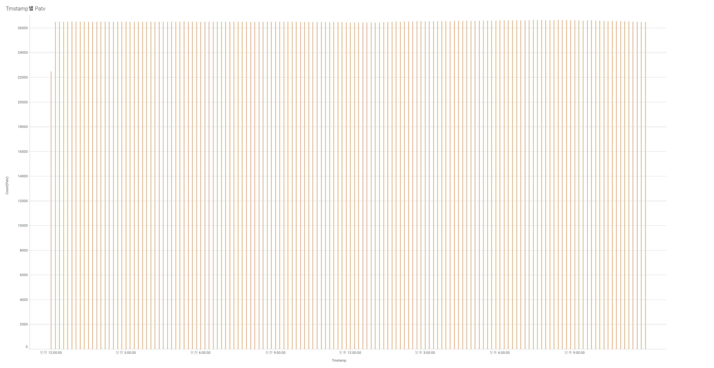

# 1. Features
1. `TurbID`
   - `TurbID=53, 76, 92, 99, 100, 115, 124` 의 평균 `Patv`가 17000 이하로 낮다. \
     이들의 위치와 관련이 있는걸까?
2. `Day`
   - 데이터가 적은 날과 많은 날의 차이가 크다. (최대 ~ 4 x 최소)
   - 날마다 평균 `Patv`도 천차만별
3. `Tmstamp`
   - 고르게 분포되어 있으나(최대 ~ 1.2 x 최소), 오후 9시 경의 데이터가 가장 많고, 오후 12시 경이 가장 적다.
   - 오후 6시 경에 가장 평균 `Patv`가 높고, 오전 8시 30분 경에 가장 낮다.
   - 💡 **`Day`별로 `Tmstamp`가 차이가 큰 분포를 가지고 있기 때문에 평균적인 통계는 무의미해보인다.**
4. `Wspd`
   - 🔧 **0에 많은 값이 몰려 있어 처리할 필요가 있고, log 변환이 필요해보인다.**
     - 💡 **`Wspd=0` 이면, `Prtv, Patv` 모두 0이다. (10063 rows)**
   - 💡 **아래와 유사한 그래프를 보이나, `20 < Wspd < 25` 구간에서 더 높은 층이 존재한다.** 
     
5. `Wdir`
   - 거의 전부 -20~20 사이의 값이고, 대부분 0이다.
   - `Avg(Patv) ~ Wdir` 분포가 정규분포를 따른다.
6. `Etmp`
   - [0, 50] 이내의 값에 대한 `Avg(Patv)`는 이외의 것에 비해 작다.
   - 💡 **[0, 50] 이외의 값(약 7%)은 아마도 이상치로 생각된다. \
   그러나, 이들을 제거해버리면 `Avg(Patv)`가 높은 데이터들을 모두 잃기 때문에 그럴 순 없다. \
   차라리 `Etmp` feature를 제거하는 편이 나을 것 같다.**
7. `Itmp`
   - [6, 60] 이내의 값에 대해선, `Itmp`의 분포도, `Avg(Patv) ~ Itmp` 분포도 훌륭하다.
   - 💡 **[6, 60] 이외의 값에 대해선 `Avg(Patv)`이 대부분 0이라 제거해도 괜찮을 것 같다.**
8. `Ndir`
   - 딱히 건드릴 필요 없을 정도로 분포의 형태가 좋다.
9. `Pab1,2,3`
   - 💡 **값 자체는 0, 90에 많이 쏠려있으나 `Avg(Patv)`와의 분포가 상당히 유의미하다.**
10. `Prtv`
    - 🔧 **-501 이하의 이상치들은 제거하는 게 좋아보인다. (13 rows)**
11. `Patv`
    - 🔧 **0 값이 나오는 경우를 잘 다루는 것이 이 문제의 핵심**
    - 🔧 **[0, 1] 이내의 값이 23만개로 전체 데이터의 8%를 차지한다. 어떻게든 처리가 필요해 보인다.**
12. `Location_X`, `Location_Y`
    - `TurbID`의 위치

# 2. Missing values
1. **45587개** rows가 `TurbID`, `Day`, `Tmstamp`를 제외한 모든 feature들에서 Nan값을 가진다.
2. `Day=65, 66, 67` 에서 모든 Turbine이 missing value를 가진다. (**32438개** rows) \
나머지는 각각의 Turbine에서 발생한 문제라고 보는 것이 좋을 듯하다. 
    .jpg)
    .jpg)
3. `Tmstamp=00:00`에서도 missing value가 자주 나타난다. (**41240개** rows) \
`Days`를 처리하고 난 다음엔 **9070개** rows가 missing value로 남아있다.
    

# 3. Feature engineering
1. Power, RPM과 관련된 변수들을 추가
   - `Wspd^3`
   - `Wspd_cos` = `Wspd * cos(Wdir/180 * π)`
   - `TSR1`, `TSR2`, `TSR3` = `cot(Pab + alpha)`, `alpha=20`
   - `Bspd1`, `Bspd2`, `Bspd3` = `TSR * Wspd_cos`
   - `rpm` = `mean(Bspd)`
2. 바람의 방향을 의미하는 변수를 추가
   - `RWdir`: `Wdir - Ndir`

# 4. Anomaly handling
1. `Etmp`, `Itmp` 이상치: interpolation

---

1. 시간에 따른 비중 차이를 두어야 함
2. 육풍, 해풍을 고려한 하루 내 시간 고려
