~!# Top rank: baseline11 

---

# 1. [baseline1.ipynb](proposed/baseline1.ipynb)
## Data
- Train data: 5일
- Test data: 2일
- Sliding window로 생성

## Training
- NN: GRU(256) - Dense(516) - Dense(288)
- Optimizer: RMSProp(lr=1e-3)
- Loss: MSE
- Epochs: 10
- Batch size: 128

```
 File Name : 
	baseline1.csv

Accuracy:  46.7085%

 	 RMSE: 26.80773266298162, MAE: 19.66573268982056

 --- Overall Score ---
	23.23673267640109
```


# 2. [proposed1.ipynb](proposed/proposed1.ipynb)
**baseline1** 에서 다음을 추가

## Data
- `StandardScaler` 적용

```
 File Name : 
	proposed1.csv

Accuracy:  47.1609%

 	 RMSE: 50.91567351662873, MAE: 46.670559504018996

 --- Overall Score --- 
	48.79311651032386
```

---

# 3. [proposed2.ipynb](proposed/proposed2.ipynb)
**baseline1** 에서 다음을 추가

## Training
- Validation set 추가
- Early stopping(patience=10) 추가
    - Overfitting이 심해 많이 학습하지 못한다 → Regularization 필요

```
 File Name : 
	proposed2.csv

Accuracy:  54.0560%

 	 RMSE: 24.517586741073245, MAE: 17.771835530432146

 --- Overall Score --- 
	21.144711135752694
```


# 4. [proposed3.ipynb](proposed/proposed3.ipynb)
**proposed2** 에서 다음을 추가

## Model
- `BatchNormalization`, `Dropout` 추가
  ```
  model = Sequential([
      GRU(256, input_shape=train_x[0].shape),
      BatchNormalization(),
      Dropout(0.4),
      
      Dense(516, activation='relu'),
      BatchNormalization(),
      Dropout(0.4),
  
      Dense(288, activation='relu')
  ])
  ```

```
 File Name : 
	proposed3.csv

Accuracy:  40.8675%

 	 RMSE: 26.95957636335696, MAE: 19.47166986231859

 --- Overall Score --- 
	23.215623112837775
```


# 5. [proposed4.ipynb](proposed/proposed4.ipynb)
**proposed2** 에서 다음을 추가

## Data
- `TurbID` 별로 model을 생성

```
 File Name : 
	proposed4.csv

Accuracy:  54.3031%

 	 RMSE: 34.0816873234851, MAE: 30.090377192844116

 --- Overall Score --- 
	32.08603225816461
```


# 6. [proposed6.ipynb](proposed/proposed6.ipynb)
**proposed5** 에서 다음을 추가

## Data
- `Wspd_cos`, `TSR1, 2, 3`, `Bspd1, 2, 3`, `rpm` 추가 
```
train_data['Wspd_cos'] = train_data['Wspd']*np.cos(train_data['Wdir']/180*np.pi)

alpha = 20
train_data['TSR1'] = 1/np.tan(np.radians(train_data['Pab1']+alpha))
train_data['TSR2'] = 1 / np.tan(np.radians(train_data['Pab2'] + alpha))
train_data['TSR3'] = 1 / np.tan(np.radians(train_data['Pab3'] + alpha))    

train_data['Bspd1'] = train_data['TSR1'] * train_data['Wspd_cos']
train_data['Bspd2'] = train_data['TSR2'] * train_data['Wspd_cos']
train_data['Bspd3'] = train_data['TSR3'] * train_data['Wspd_cos']

train_data['rpm'] = (train_data['Bspd1'] + train_data['Bspd2'] + train_data['Bspd3']) / 3
```

```
 File Name : 
	proposed6.csv

Accuracy:  55.3906%

 	 RMSE: 26.382792118773786, MAE: 20.4176044874672

 --- Overall Score --- 
	23.400198303120494
```


# 7. [proposed7.ipynb](proposed/proposed7.ipynb)
**proposed5** 에서 다음을 추가

## Data
- Validation set을 여러 개로 사용 (Training set과 겹치는 부분 있음)


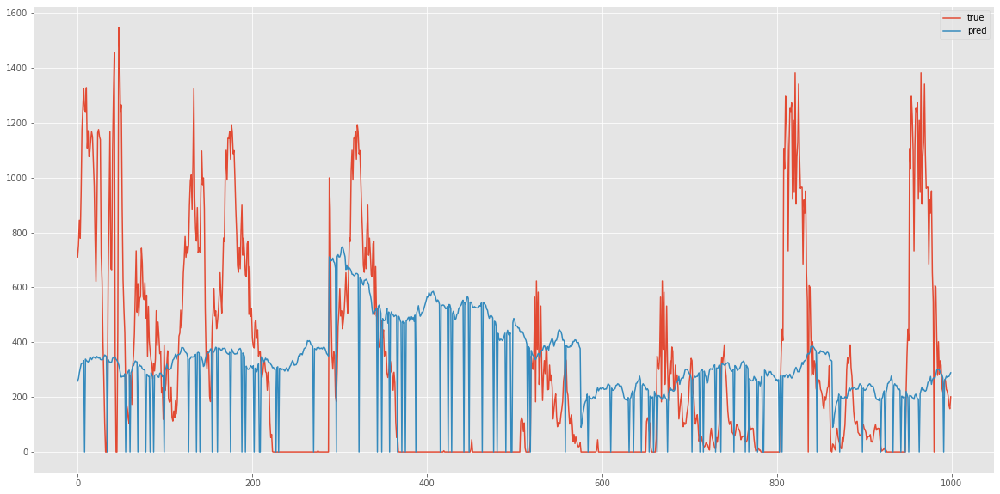
- `Patv=0`인 부분을 잘 다듬어야 한다.

```
 File Name : 
	proposed7.csv

Accuracy:  52.8691%

 	 RMSE: 26.707425563416784, MAE: 20.76662316993727

 --- Overall Score --- 
	23.737024366677026
```


# 8. [proposed8.ipynb](proposed/proposed8.ipynb)
**proposed7** 에서 다음을 추가

## Data
- Feature engineering 추가 (proposed6 보다 개선)

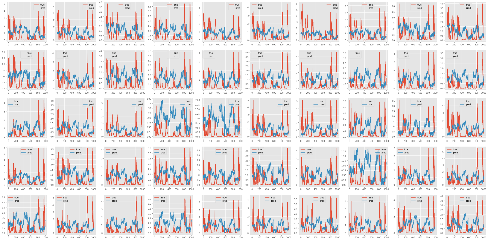

```
 File Name : 
	proposed8.csv

Accuracy:  32.0247%

 	 RMSE: 34.68416953844638, MAE: 27.361807267416847

 --- Overall Score --- 
	31.022988402931617
```


# 9. [proposed9.ipynb](proposed/proposed9.ipynb)
**proposed8** 에서 다음을 추가

## Data
- `Patv`만 사용하여 예측

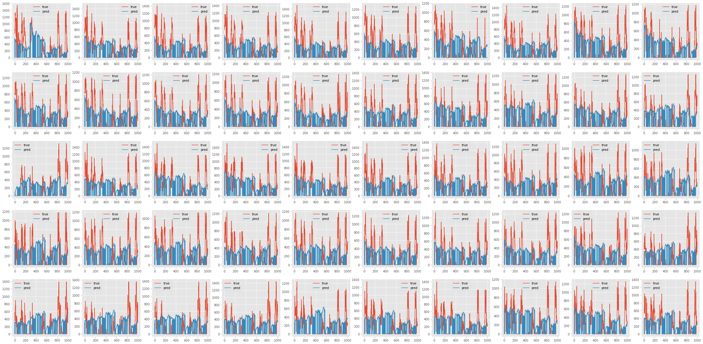


```
 File Name : 
	proposed9.csv

Accuracy:  49.4525%

 	 RMSE: 28.70997457789587, MAE: 22.651805544984676

 --- Overall Score --- 
	25.680890061440273
```


# 10. [proposed10.ipynb](proposed/proposed10.ipynb)
**proposed7** 에서 다음을 추가

## Model
`f: X_{1:t-s}, y_{1:t-s} → X_{t-s+1:t}, y_{t-s+1:t}`


```
 File Name : 
	proposed10.csv

Accuracy:  62.8850%

 	 RMSE: 47.01281746268941, MAE: 44.8693864877889

 --- Overall Score --- 
	45.94110197523916
```


# 11. [proposed11.ipynb](proposed/proposed11.ipynb)
[medium article](https://towardsdatascience.com/gru-recurrent-neural-networks-a-smart-way-to-predict-sequences-in-python-80864e4fe9f6)

Encoder - Decoder 모델 적용,
input, output
288*n_features, 288*n_features 로 변경


# 12. [proposed12.ipynb](proposed/proposed12.ipynb)
**proposed7** 에서 다음을 추가

## Data
- StandardScaler

## Model
- TensorFlow Time Series example (LSTMCell)


# 13. [proposed13.ipynb](proposed/proposed13.ipynb)
## Data
- `generate_full_timestamp()`
- `fillna(method='bfill')`
- `preprocess()`
- `select_features()`
- `marking_data()`
- `make_train_val_test_data(in_seq_len=2*144, out_seq_len=2*144, stride=144, shuffle=False, test_size=0.2)`
- `generate_dataset(train_x_clean, train_y, batch_size=256, shuffle=True)`

## Model
- `proposed12.ipynb`와 동일

# 14. [proposed14.ipynb](proposed/proposed14.ipynb)
## Data
marking abnormals to Zero
features = ['TurbID','Day', 'WspdY_abs', 'Itmp', 'WdirX', 'WspdX_abs', 'Patan', 'Prtv', 'TSR', 'Pab', 'P_max', 'Wspd_cube', 'Wspd', 'WspdX', 'RPM', 'Papt', 'Patv']

## Model
- `proposed11.ipynb`와 동일
- 
 Accuracy: 55.0360%

  RMSE: 399.5539085862987, MAE: 300.3371543627951
--- Overall Score --- 349.9455314745469


# 15. [proposed15.ipynb](proposed/proposed15.ipynb)
## Data
marking abnormals to Zero
features = ['TurbID','Day','RPM', 'Bspd1', 'Bspd3', 'Bspd2', 'WspdX', 'Wspd', 'Wspd_cube',
       'P_max', 'Pab1', 'Pab2', 'Pab3', 'TSR1', 'TSR2', 'TSR3', 'Prtv','Patv']
## Model
- transformer 사용

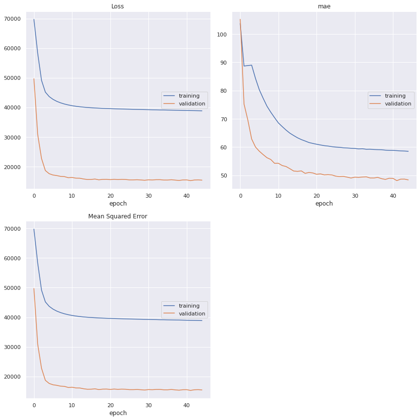


# 16. [proposed16.ipynb](proposed/proposed16.ipynb)
## Data
1. Impute data
   ```
   threshold = 12*6 (12 hour)
   ```
2. Feature engineering
3. Smoothing `Patv`
4. Split data
    ```
    IN_SEQ_LEN  = 2*144
    OUT_SEQ_LEN = 2*144
    STRIDE      = 144
    SHUFFLE     = False
    TEST_SIZE   = 0.2
    ```
5. Feature selection
   ```
   threshold = 0.4
   ```
6. TensorFlow Dataset
   ```
   BATCH_SIZE = 256
   SHUFFLE    = False
   ```

## Model
[LSTM-RNN Feedback network](https://www.tensorflow.org/tutorials/structured_data/time_series?hl=ko#%EA%B3%A0%EA%B8%89_%EC%9E%90%EA%B8%B0_%ED%9A%8C%EA%B7%80_%EB%AA%A8%EB%8D%B8)

## Training
- Optimizer: Adam
- Loss: mse
- EarlyStopping(patience=10)
- ReduceLROnPlateau(factor=0.9, patience=3)

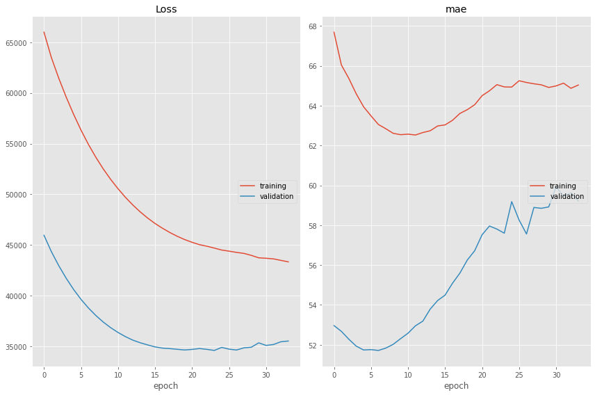
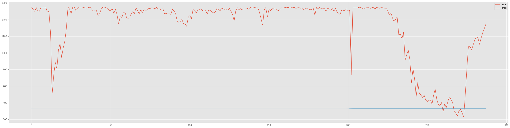
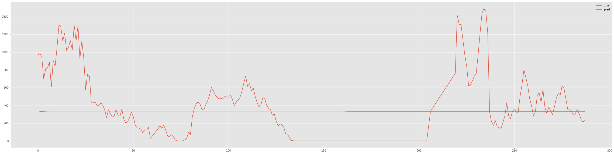

```
 File Name : 
	proposed16.csv

Accuracy:  56.4644%

 	 RMSE: 400.65273414975206, MAE: 333.50006322548563

 --- Overall Score --- 
	367.07639868761885
```


# 17. [proposed17.ipynb](proposed/proposed17.ipynb)
**proposed16** 에서 Transformer([Timeseries classification with a Transformer model](https://keras.io/examples/timeseries/timeseries_transformer_classification)) 추가

1. [proposed17.ipynb](proposed/proposed17.ipynb)
   - Scaling X
   
    ```
     File Name : 
        proposed17.csv
    
    Accuracy:  61.0097%
    
         RMSE: 387.11069723116805, MAE: 310.92304896237306
    
     --- Overall Score --- 
        349.01687309677055
    ```
    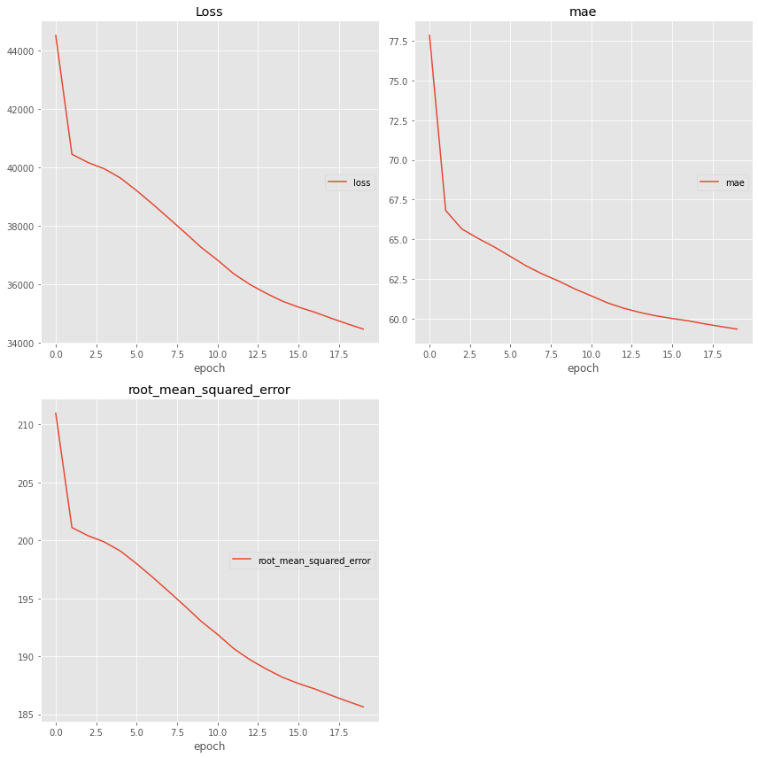 
    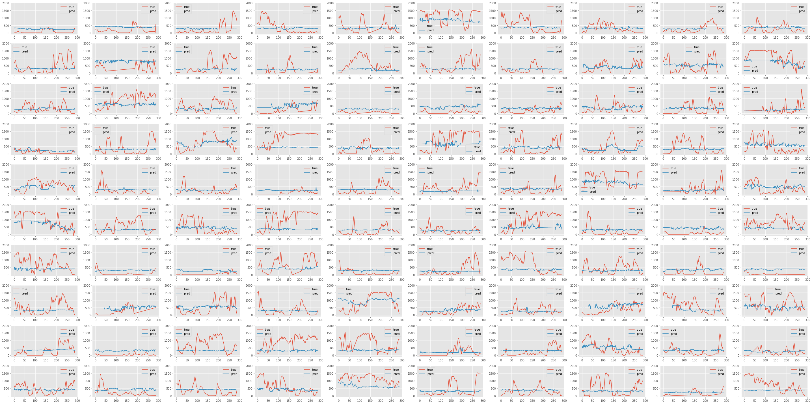 

2. [proposed17-BN.ipynb](proposed/proposed17-BN.ipynb)
   - Scaling X
   - Input layer 뒤에 Batch Normalization 추가

   ```
     File Name : 
        proposed17-BN.csv
    
    Accuracy:  60.2466%
    
         RMSE: 375.23501836364164, MAE: 279.8426663328266
    
     --- Overall Score --- 
        327.5388423482341
    ```

4. [proposed17-MinMax.ipynb](proposed/proposed17-MinMax.ipynb) 
   - MinMaxScaler 사용

    ```
     File Name : 
        proposed17-MinMax.csv
    
    Accuracy:  59.2988%
    
         RMSE: 467.9350048008359, MAE: 417.54909776180284
    
     --- Overall Score --- 
        442.7420512813194
    ```


# 18. [proposed18.ipynb](proposed/proposed18.ipynb)
**proposed17** 에서 다음을 추가

## Data
- `MinMaxScaler` 적용
- `position_encoding()` 적용
- Anomaly marking 적용

## Model
- Parameter
    ```
    head_size=32, num_heads=32, ff_dim=32, num_transformer_blocks=16, mlp_units=[128]
    ```

## Training
- Overfitting을 위해 validation set 사용 X

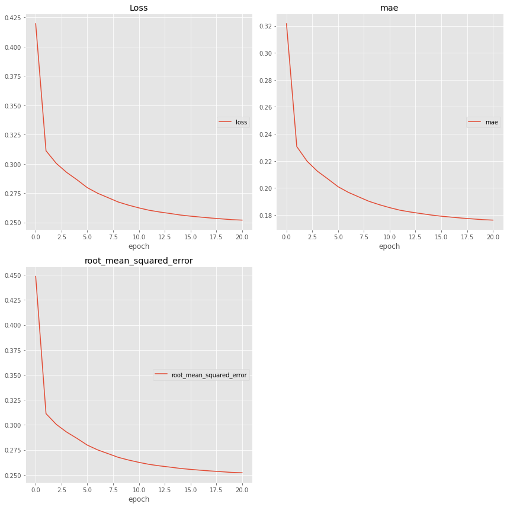 
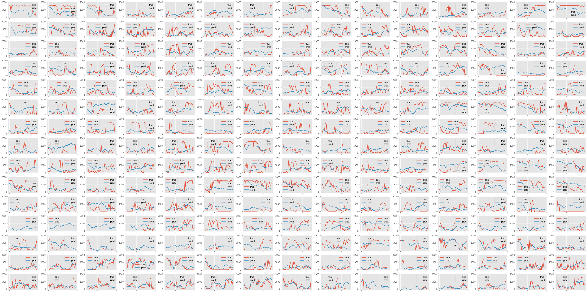 

```
 File Name : 
	proposed18.csv

Accuracy:  32.2599%

 	 RMSE: 583.0144026773515, MAE: 447.17038576125105

 --- Overall Score --- 
	515.0923942193012
```


# 19. [proposed19-use_all_features.ipynb](proposed/proposed19-use_all_features.ipynb)
## Data
    ```
    impute_data()
    outlier_handler(['Etmp', 'Itmp', 'Wspd'])
    feature_engineering()
    select_features()
    MinMaxScaling()
    Set Patv of X to zero
    ```

## Model
- GRU-Model
